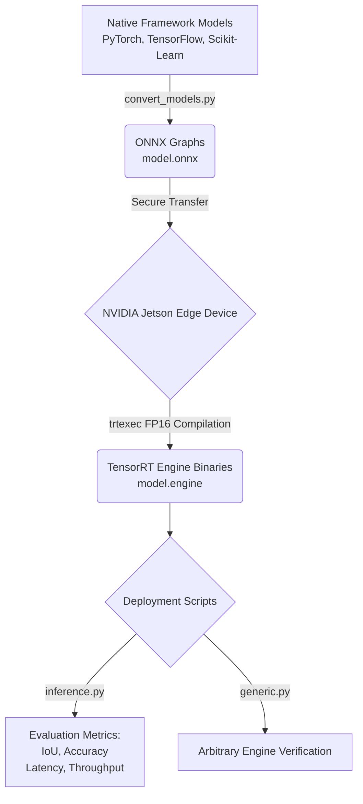

# Edge AI Flood Segmentation and TensorRT Deployment Pipeline

This repository contains a Machine Learning Operations(MLOps) pipeline for training, converting, and deploying flood detection and segmentation models onto edge hardware. The primary objective is to optimise neural networks for real-time inference on the NVIDIA Jetson Orin Nano using TensorRT.

---

## System Workflow



---

## Repository Structure

```
├── Notebooks/
│   ├── Resnet50.ipynb          # Deep residual feature extraction and transfer learning pipeline
│   ├── CNN_LSTM.ipynb          # Spatiotemporal sequence modeling using ConvLSTM2D
│   └── CNN_FCNN_UNet.ipynb     # Multi-model benchmark pipeline, handling spatial pixel imbalances with custom Combined Losses (BCE + Dice Loss).
├── models/
│   ├── CNN_LSTM.onnx           # ONNX graph for LSTM network
│   ├── fcnn.onnx               # ONNX graph for FCNN
│   ├── simple_cnn.onnx         # ONNX graph for Baseline CNN
│   └── u-net.onnx              # ONNX graph for U-Net architecture
├── engines/                    # Generated TensorRT engines (Jetson Orin Nano device)
│   ├── CNN_LSTM.engine
│   ├── fcnn.engine
│   ├── simple_cnn.engine
│   └── u-net.engine
├── test/                       # Raw input validation images
├── mask/                       # Ground truth binary masks
├── convert_models.py           # Universal ONNX conversion script (support PyTorch, TensorFlow, Scikit-Learn)
├── inference.py                # Batch benchmarking and metric calculations like mean IoU, mean accuracy, mean latency(ms) and throughput(FPS)
└── generic.py                  # Dynamic TensorRT deployment script for arbitrary engines
```

---

## Hardware Performance Comparison

The following table documents the performance acceleration achieved by migrating inference from a standard x86 CPU to the NVIDIA Jetson Orin Nano GPU with TensorRT FP16 half-precision optimization.

| Model Architecture | Mean IoU | Mean Accuracy | Jetson Latency | PC Latency | Jetson FPS | PC FPS | Speedup |
|--------------------|----------|---------------|----------------|------------|------------|--------|---------|
| FCNN               | 0.4832   | 0.9732        | 4.29 ms        | 14.15 ms   | 233.28     | 70.66  | 3.3x    |
| CNN                | 0.6528   | 0.9837        | 2.82 ms        | 10.93 ms   | 354.11     | 91.52  | 3.9x    |
| ResNet50           | 0.3102   | 0.9555        | 14.82 ms       | 75.93 ms   | 67.48      | 13.17  | 5.1x    |
| U-Net              | 0.7180   | 0.9863        | 11.91 ms       | 77.96 ms   | 83.98      | 12.83  | 6.5x    |
| CNN_LSTM           | 0.5614   | 0.9743        | 5.95 ms        | 37.98 ms   | 168.06     | 26.33  | 6.4x    |

---

## Prerequisites and Environment Setup (Jetson)

Before compiling engines or running inference, the NVIDIA Jetson device requires specific dependencies for TensorRT and PyCUDA.

```bash
# Update package lists
sudo apt-get update

# Install TensorRT and its Python developer libraries (includes trtexec)
sudo apt-get install tensorrt libnvinfer-dev python3-libnvinfer-dev -y

# Install CUDA development toolkit
sudo apt install -y nvidia-cuda-dev

# Export environment variables for CUDA paths (Add these to ~/.bashrc for permanence)
export PATH=/usr/local/cuda/bin:$PATH
export LD_LIBRARY_PATH=/usr/local/cuda/lib64:$LD_LIBRARY_PATH

# Install PyCUDA for GPU memory allocation during Python inference
pip3 install pycuda --break-system-packages
```

---

## Usage

### 1. Model Conversion to ONNX (Host System)

The `convert_models.py` script automatically detects the source framework (PyTorch, TensorFlow, or Scikit-Learn) based on file extension and converts all native models in the input directory to a unified ONNX format.

```bash
python3 convert_models.py
```

### 2. TensorRT Engine Compilation (Jetson Device)

Once the `.onnx` files are transferred to the Jetson, use the native `trtexec` compiler to build the hardware-specific execution plan. The `--fp16` flag enables half-precision inference on the Orin Nano's Tensor Cores.

```bash
/usr/src/tensorrt/bin/trtexec --onnx=models/u-net.onnx --saveEngine=engines/u-net.engine --fp16
```

### 3. Batch Inference and Metric Validation

Run a full dataset evaluation computing Intersection over Union (IoU), Pixel Accuracy, and operational latency. Ensure the `test/` and `mask/` directories are populated before execution.

```bash
python3 inference.py
```

### 4. Generic Arbitrary Engine Validation

The `generic.py` script serves as a universal deployment harness. It accepts any TensorRT engine file, dynamically discovers the required input/output tensor shapes, allocates the appropriate CUDA memory blocks, and executes a synthetic data pass to verify deployment latency independently of domain-specific preprocessing.

```bash
python3 generic.py --engine engines/u-net.engine
```
